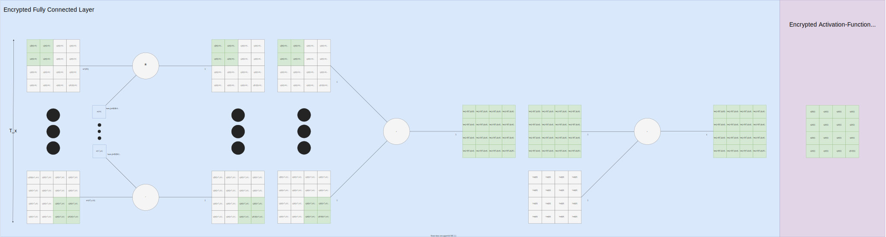

.. include:: substitutions

.. |activation-fig| image:: img/sigmoid.png
  :width: 400
  :alt: Graph of sigmoid plotted on 2d axes

.. |ann-derivative-fig| image:: img/sigmoid.png
  :width: 400
  :alt: Graph of sigmoid plotted on 2d axes

.. |neuron-fig| image:: img/neuron.svg
  :width: 400
  :alt: Artificial neural network single neuron

.. |neuron-cg-fig| image:: img/neuron-computational-graph.svg
  :width: 400
  :alt: Single neuron represented as computational graph of inputs and outputs

Fully Connected Dense Net (ANN)
###############################

.. |ann| replace:: :eq:`ann`
.. |ann-commuted| replace:: :eq:`ann-commuted`

Here ANN shall mean a fully connected/ dense neuron.
Usually these are depicted similar to the following:

|neuron-fig|

We however want to keep using a computational graph style. This computational graph style is not as neat as the traditional style, however we find it much more helpful when doing things like visually inspecting operations that are important to account for in FHE, as each individual operation comes at a cost, and sometimes it can be difficult to see how many steps are involved in the traditional style depictions. Follows is out computational graph variant of the previous neuron:

|neuron-cg-fig|

We can then expand these computational graphs to show en-mass operations. This is even more helpful as now we can see how the data comes in together, and how each multi-dimensional matrix accrues the same operations upon it. This is important as we do not encrypt individual values by themselves. Instead they are encoded into a polynomial and that polynomial is then encrypted. Please keep in mind the |section_commuted_sum|.

ANN Equations
+++++++++++++++++

Thankfully there needs not be any approximation in an ANN ignoring the activation function.
Thus our ANN can be largely unchanged compared to standard implementations, both being polynomials (excluding :math:`g`)

ANN
-------

|ann-fig|

|ann| ANN: There is little unique about our ANN with the exception of the application of the bias.

Normal ANN equation (not compatible with our representations, where :math:`w_0` is actually the bias):

.. math::
  :label: ann

  a = g(\sum_{i=1}^{T_x}(w_ix_i)+w_0)

Our ANN implementation |ann-commuted| slightly differs to this |ann|, to handle the |section_commuted_sum| problem is as follows but note how the bias is divided by :math:`N` which in normal scenarios is simply 1 since it would be a single value, whereas in scenarios where an input :math:`x` is an un-summable cyphertext holding a multi-dimensional array, :math:`b/N` serves to counteract broadcasting of values keeping activations in the golden range for our activation function:

.. math::
  :label: ann-commuted

  a^{(i)} = g(\sum_{t=0}^{T_x-1}(w^{<t>}x^{(i)<t>})+b/N)

ANN Derivatives
---------------

The derivative of an ANN (:math:`f`) with respect to the bias :math:`b`:

.. math::
  :label: ann-dfdb

  \frac{df}{db} = 1 \frac{dg}{dx}

The derivative of an ANN (:math:`f`) with respect to the weights :math:`w`:

.. math::
  :label: ann-dfdw

  \frac{df}{dw^{<t>}} = x^{(i)<t>} \frac{dg}{dx}

The derivative of a ANN (:math:`f`) with respect to the input :math:`x`:

.. math::
  :label: ann-dfdx

  \frac{df}{dx^{(i)<t>}} = w^{<t>} \frac{dg}{dx}

.. note::

  .. include:: variables

ANN API
-------

.. autoclass:: fhez.nn.layer.ann.ANN
  :members:
