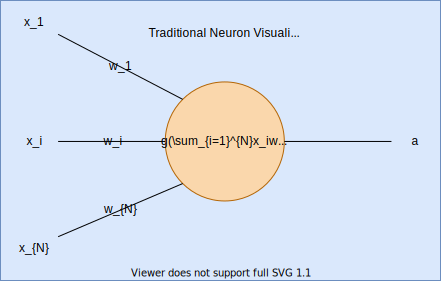

.. include:: substitutions

.. |ann-fig| image:: img/ann.svg
  :width: 700
  :alt: Full ANN computational graph

Fully Connected Dense Net (ANN)
###############################

.. |ann| replace:: :eq:`ann`
.. |ann-commuted| replace:: :eq:`ann-commuted`
.. |ann-deriv| replace:: :eq:`ann-derivative`

Here ANN shall mean a fully connected/ dense neuron.
Usually these are depicted similar to the following:

|neuron-fig|

We however want to keep using a computational graph style. This computational graph style is not as neat as the traditional style, however we find it much more helpful when doing things like visually inspecting operations that are important to account for in FHE, as each individual operation comes at a cost, and sometimes it can be difficult to see how many steps are involved in the traditional style depictions. Follows is out computational graph variant of the previous neuron:

|neuron-cg-fig|

We can then expand these computational graphs to show en-mass operations. This is even more helpful as now we can see how the data comes in together, and how each ndimensional matrix accrues the same operations upon it. This is important as we do not encrypt individual values by themselves. Instead they are encoded into a polynomial and that polynomial is then encrypted. This brings about the final caveat we want to talk about here, and that is the 0th-sum. Since these values are encoded as one long polynomial we cannot "fold" the encryption in on itself, I.E we cannot sum through this polynomial. This is a special case when sums would usually occur in say each filter of a CNN after it has been cross-correlated with sections of the input x. These cross-correlated sections would usually be summed, but we can not do this as again we cannot sum through a cyphertext, we can only sum between cyphertexts. This means we have to treat these ndimensional arrays as if they were singular values, and commute the summation to post decryption. Thus what you put in is what you get out, it will retain its shape, the end result must simply be summed to retrieve the answer once it has been decrypted by the user. We call this the |section_commuted_sum|. Every operation in every network must account for this |section_commuted_sum| in particular broadcasting should never occur unless expressly desired.

ANN Equations
+++++++++++++++++

Thankfully there needs not be any approximation in an ANN ignoring the activation function.
This our ANN can be largely unchanged to standard implementations being a polynomial

ANN
-------

|ann| ANN: There is little unique about our ANN with the exception of the application of the bias.

Normal ANN equation:

.. math::
  :label: ann

  a = g(\sum_{i=0}^{n-1}(w_ix_i)+b)

Our ANN implementation |ann-commuted| slightly differs to this |ann|, to handle the commuted-sum problem is as follows but note how the bias is divided by :math:`n` which in normal scenarios is simply 1 but in scenarios where an input :math:`x_i` is an ndimensional array such as when we are dealing with a commuted sum, serves to counteract broadcasting of values keeping activations in a sensible range:

.. math::
  :label: ann-commuted

  a = g(\sum_{i=0}^{n-1}(w_ix_i)+b/n)

.. note::

  where:

  - :math:`g`; some activation function e.g :math:`\sigma_a` (see:|section_sigmoid_approx|)
  - :math:`m`; the total number of input arrays to the network in one pass
  - :math:`n`; the total number of elements in any individual input array
  - :math:`w_i`; the :math:`i`'th weight that corresponds to the :math:`i`'th input (:math:`x`) of the network
  - :math:`x_i`; the :math:`i`'th input (:math:`x`) into the network in one forward pass
  - :math:`a`; the output / activation of this neural network (if the last network then :math:`a=\hat{y}`)
  - :math:`y`; the (normalized) ground-truth / observed outcome
  - :math:`\hat{y}`; the (normalized) prediction of :math:`y`

Visual computational graph (rough) implementation of |ann-commuted|:

|ann-fig|

ANN Derivative
------------------

|ann-deriv| ANN derivative

.. math::
  :label: ann-derivative

  \frac{d\sigma(x)}{dx} = \frac{e^{-x}}{(1+e^{-x})^2} = (\frac{1+e^{-x}-1}{1+e^{-x}})(\frac{1}{1+e^{-x}}) = (1-\sigma(x))\sigma(x)

|ann-derivative-fig|
