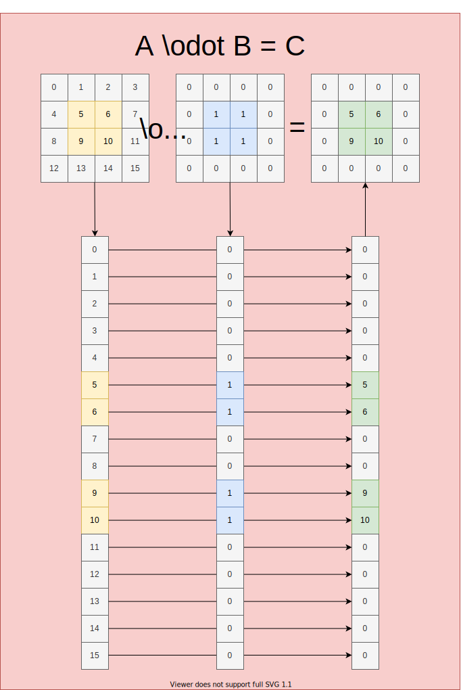

.. include:: substitutions

.. |cnn-fig| image:: img/cnn.svg
  :width: 700
  :alt: Full CNN computational graph

.. |cnn-ann-loss-fig| image:: img/cnn-ann-loss.svg
  :width: 700
  :alt: Full end-to-end cnn-ann-loss computational graph

Convolutional Neural Network (CNN)
##################################

|cnn-fig|

Convolutional neural networks are quite complicated cases with FHE.
Since the encrypted cyphertext is the most atomic form of the input data that we can access and we need to be able to multiply subsets of the data by different amounts we use a sparse n-dimensional array with the weights embedded in different positions and the rest zeroed out (see |section_hadmard_product|). This way we can still convolve out filters but instead of manipulating :math:`x` (normally by selecting a slice of :math:`x` that you were interested in) we manipulate the filter instead generating windows where the filter should be placed, and caching these windows for later use in back-propogation so we know exactly what input :math:`x` multiplied which weights once :math:`x` is finally decrypted.

.. math::
  :label: cnn

  a = g(\sum_{i=0}^{n-1}(w_ix_i)+b/n)

.. math::
  :label: cnn-commuted

  a = g(\sum_{i=0}^{n-1}(w_ix_i)+b/n)

.. note::

  .. include:: variables

.. _section_hadmard_product:

Hadmard Product
+++++++++++++++

The Hadmard product is simply two equally shaped n-dimensional arrays operated on element wise to produce a third product n-dimensional array of the same size/ shape:

|hadmard-fig|

.. _section_commuted_sum:

Commuted-Sum
++++++++++++

.. warning::

  If you are intending to write your own or extend an additional neural network please pay special attention to the |section_commuted_sum|, it will change the behavior of the networks drastically and in some unexpected ways if it is not accounted for. CNNs and other single input multiple branch networks are the source of commuted-sums.

|cnn-ann-loss-fig|

CNN API
-------

.. autoclass:: fhe.nn.layer.cnn.Layer_CNN
  :members:
