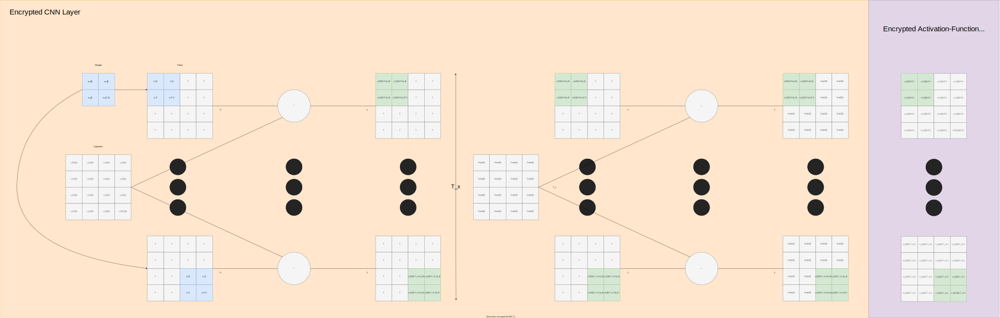

.. include:: substitutions

.. |hadmard-fig| image:: img/hadmard-product.svg
  :width: 400
  :alt: Hadmard product of two 2D matrices

.. |cnn-ann-loss-fig| image:: img/cnn-ann-loss.svg
  :width: 700
  :alt: Full end-to-end cnn-ann-loss computational graph

.. |mnist-nn| raw:: html
  :file: img/mnist-nn-graph.html

.. _section_examples:

Examples
########

We have a few in-progress examples, primarily in the examples directory in the python-reseal repository. These examples use Jupyter Lab to make it as easy and as streamlined as possible for others to use our code/ play around with our code. Further to this you will note there are two dockerfiles in the python-reseal repository, one that expressly states jupyter which is expressly for these examples since they often require more dependencies than the base library itself we bundled things separately. To make it even easier we also included a bash script called run-jupyter which builds and runs the jupyter dockerfile with all our dependencies within, launches the server and gives you a link to the server usually: http://127.0.0.1:8888 + some authentication key and also mounts the examples directory as a volume so you could save any workings beyond the container as long as they are done inside the examples directory.

All of our examples should be played with using this Dockerfile for now as we improve our build system and make it easier to install our very complex library.

Step-by-Step Instructions for Example Usage
+++++++++++++++++++++++++++++++++++++++++++

For any following example they are all accessed from the same container, which in theorey since it is a Docker container can run on any 64-bit based system.

Generic
-------

- Install Git
  - https://git-scm.com/book/en/v2/Getting-Started-Installing-Git
- Install Docker
  - https://docs.docker.com/engine/install/
- Ensure Docker is running
  - https://docs.docker.com/config/daemon/
- Download source code
  - Download from GitHub using command line/ terminal: ``git clone https://github.com/dreamingraven/python-reseal``
  - Or download from GitHub GUI and unzip: https://github.com/DreamingRaven/python-reseal/releases
  - Or download from GitLab: ``git clone https://gitlab.com/georgeraven/python-reseal``
  - Or download from GitLab GUI and unzip: https://gitlab.com/GeorgeRaven/python-reseal/-/tags
- Build Docker container (this will take some time)
  - If your system supports bash then you can just run ``run-jupyter`` from inside the source directory to skip this step
  - Else from command line/ terminal within the source directory ``docker build -t archer/fhe-jupyter -f Dockerfile_archlinux_jupyter .``
- Run Docker container
  - If your system supports bash then you can just run ``run-jupyter`` from inside the source directory to skip this step
  - Else from command line/ terminal within the source directory ``docker run -p 127.0.0.1:8888:8888 -v "./examples":"/python-fhe/examples" -it archer/fhe-jupyter``
- Connect to the now running container using jupyter labs port:
  - Launch a web browser to the local address that the terminal outputs it will look something like: http://127.0.0.1:8888/lab?token=1908743694671946128946284628745628 where you should now have an interactive jupyter lab view of the code
- Play around with the examples in the "examples" directory to your hearts content

Fashion-MNIST
+++++++++++++

This doubles as an example and as reproducible code to get our results from one of our (soon to be) published papers. This example will download Fashion-MNIST (a drop in more complex replacement for standard MNIST) in CSV format, normalise it, and being the training process.

.. warning:

  While we do our best to keep resource requirements low this Jupyter script is extremely RAM intensive, it will chew through less than 32GB of RAM like a meteor did to the dinosaurs.

Interactive Graph
-----------------

The following **interactive graph** represents the neural network used for MNIST prediction to exemplify this library in use:

|mnist-nn|

Usage
-----

To run this example please use the generic docker script. Then the fashion-MNIST example is in the file fashion-mnist.ipynb which you can open in the browsers jupyter lab session (use the last of the three links).
