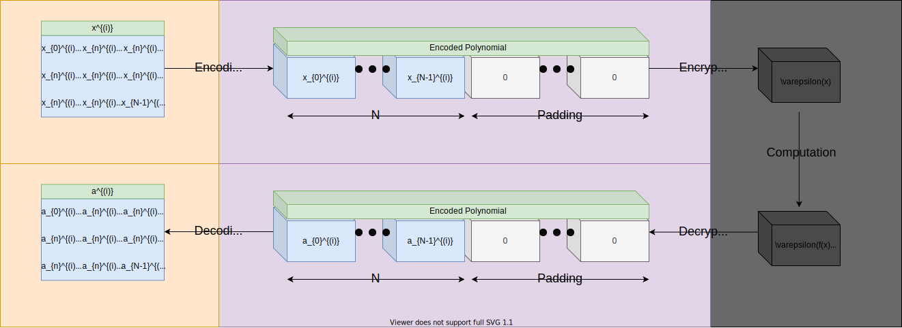

.. pyrtd documentation master file, created by
   sphinx-quickstart on Mon Aug 26 13:30:29 2019.
   You can adapt this file completely to your liking, but it should at least
   contain the root `toctree` directive.

.. include:: substitutions

.. |dl-fig| image:: img/neuron-computational-graph.svg
  :width: 400
  :alt: Example of artificial neural networks neuron, with inputs, parameters, and activations.

Python-FHEz
===========

Python-FHEz is a privacy-preserving |fhe| (FHE) and deep learning library.

Interactive graph example of an FHE compatible neural network:

.. raw:: html
  :file: img/graph.html

|fhe|:

|fhe-fig|

Deep Learning:

|dl-fig|

This library is capable of both fully homomorphically encrypting data and processing encrypted cyphertexts without the private keys, thus completely privately.

This library also supports:

* advanced serialization of cyphertext objects, for transmission over networks using marshmallow
* |section_masquerade|\ ing
* |section_hadmard_product| cyphertext branching

Cite
++++

Either:

.. code-block:: latex

  @online{fhez,
    author = {George Onoufriou},
    title = {Python-FHEz Source Repository},
    year = {2021},
    url = {https://gitlab.com/DeepCypher/Python-FHEz},
  }

Or if you do not have @online support:

.. code-block:: latex

  @misc{fhez,
    author = {George Onoufriou},
    title = {Python-FHEz Source Repository},
    howpublished = {Github, GitLab},
    year = {2021},
    note = {\url{https://gitlab.com/DeepCypher/Python-FHEz}},
  }

.. toctree::
  :maxdepth: 1
  :caption: Table of Contents
  :numbered:

  documentation
  source
  license
  fhe
  install
  examples
  graph
  traversers
  fhe_parm
  layers
  activations
  optimisers
  loss
  operations

Also See
++++++++

This is part of a larger body of related together work. We are building similar tools for go (`DarkLantern <https://gitlab.com/deepcypher/darklantern>`_). We are also building fully open-source infastructure to run FHE using the server-client model, as well as offering this as a service to others (`DeepCypher GitLab <https://gitlab.com/deepcypher>`_, `DeepCypher.me <https://deepcypher.me>`_)
