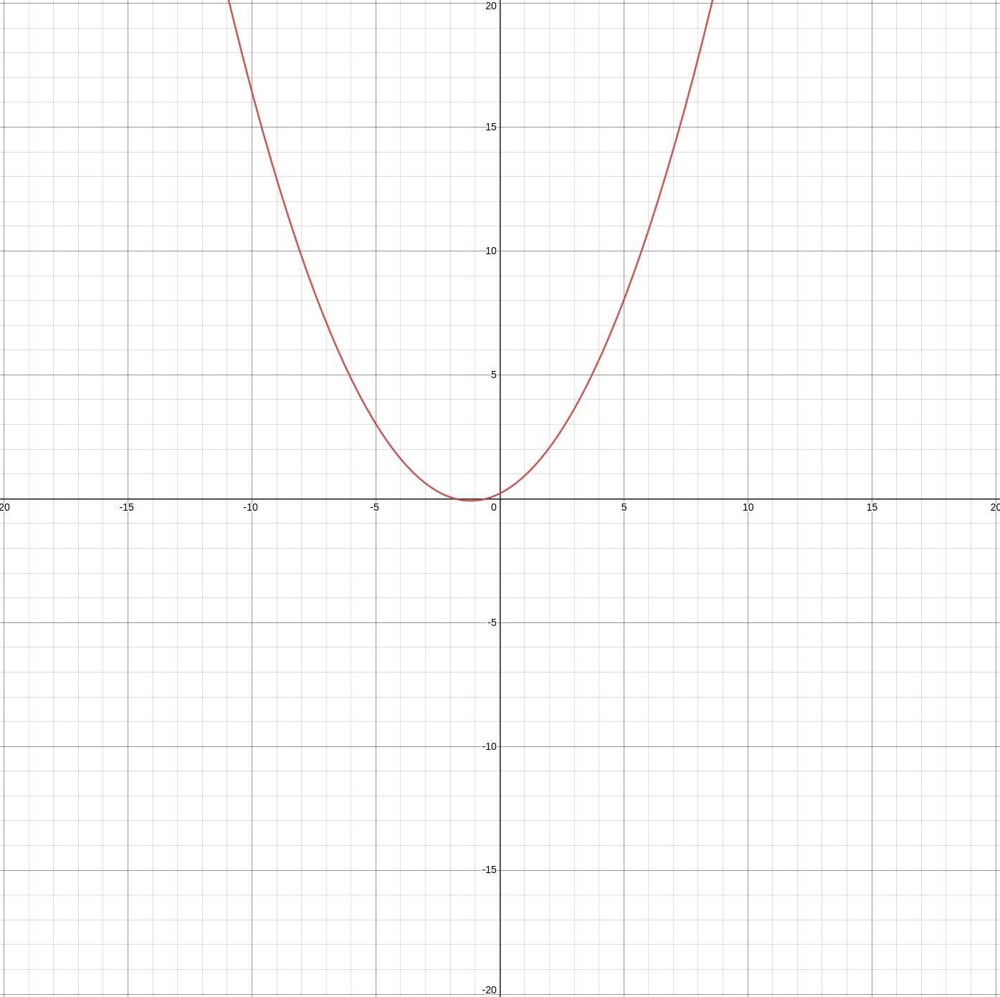

.. include:: substitutions

.. |relu-fig| image:: img/relu.png
  :width: 400
  :alt: Graph of relu plotted on 2d axes

.. |relu-approx-fig| image:: img/relu-approx.png
  :width: 400
  :alt: Graph of relu-approximation plotted on 2d axes, where the approximation range is -1,1

ReLU & Approximation
####################

.. warning::

  This activation function has an asymptote to :math:`y` infinity outside of a very small *safe* band of input :math:`x` values. This **will** cause *nan* and extremely large numbers if you aren't especially careful and keep all values passed into this activation function within the range -q to q which is its *golden* range, which can also be learned with backpropagation. Think especially carefully of your *initial* weights, and whether or not they will exceed this band into the *danger* zone. See: |section_relu_approx|

.. |relu| replace:: :eq:`relu`
.. |relu-approx| replace:: :eq:`relu-approx`
.. |relu-deriv| replace:: :eq:`relu-derivative`
.. |relu-approx-deriv| replace:: :eq:`relu-approx-derivative`

To be able to use (fully homomorphically encrypted) cyphertexts with deep learning we need to ensure our activations functions are abelian compatible operations, polynomials. relu :eq:`relu` is not a polynomial, thus we approximate :eq:`relu-approx`. Similarly since we used an approximation for the forward activations we use a derivative of the relu approximation :eq:`relu-approx-derivative` for the backward pass to calculate the local gradient in hopes of descending towards the global optimum (gradient descent).

ReLU :math:`R(x)`
++++++++++++++++++++++

.. _section_relu:

:math:`R(x)`
-----------------

|relu| Relu

.. math::
  :label: relu

  R(x)=\text{max}(0,x)

|relu-fig|

.. _section_relu_derivative:

:math:`\frac{dR(x)}{dx}`
-----------------------------

|relu-deriv|

.. math::
  :label: relu-derivative

  \frac{dR(x)}{dx} = \begin{cases} 1, & \text{if}\ x>0 \\ 0, & \text{otherwise} \end{cases}

|relu-derivative-fig|

ReLU-Approximation :math:`R_a(x)`
+++++++++++++++++++++++++++++++++++++++++++

.. _section_relu_approximation:

:math:`R_a(x)`
-------------------

|relu-approx| `relu-approximation <https://www.researchgate.net/publication/345756894_On_Polynomial_Approximations_for_Privacy-Preserving_and_Verifiable_ReLU_Networks>`_

.. math::
  :label: relu-approx

  R(x) \approx R_a(x) = \frac{4}{3\pi q}x^2 + \frac{1}{2}x + \frac{q}{3\pi}, where\ x \in \{q > x > -q \subset \R \}

where q is 1:

|relu-approx-fig|

where q is 2

|relu-approx-2-fig|

.. _section_relu_approximation_derivative:

:math:`\frac{dR_a(x)}{dx}`
-------------------------------

|relu-approx-deriv| relu-approximation derivative

.. math::
  :label: relu-approx-derivative

  \frac{dR(x)}{dx} \approx \frac{dR_a(x)}{dx} = \frac{8}{3\pi q}x + \frac{1}{2}, where\ x \in \{q > x > -q \subset \R \}

|relu-approx-derivative-fig|
