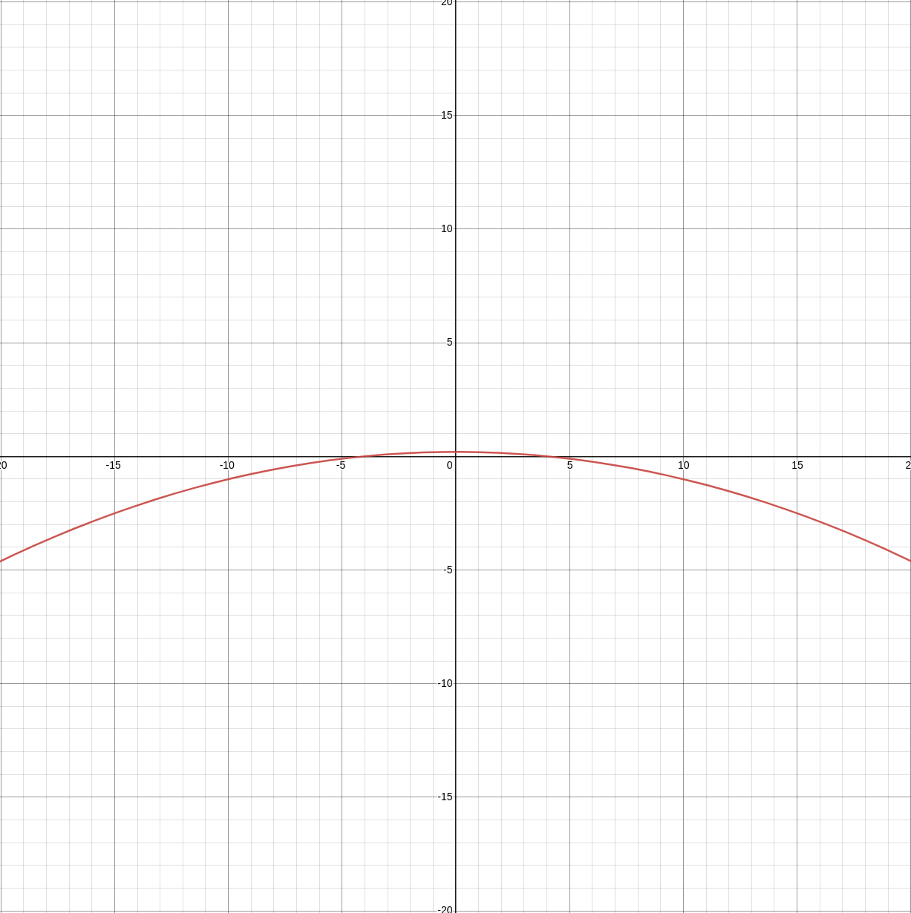

.. include:: substitutions

.. |sigmoid-fig| image:: img/sigmoid.png
  :width: 400
  :alt: Graph of sigmoid plotted on 2d axes

ides

Sigmoid & Approximation
#######################

.. |sigmoid| replace:: :eq:`sigmoid`
.. |sigmoid-approx| replace:: :eq:`sigmoid-approx`
.. |sigmoid-deriv| replace:: :eq:`sigmoid-derivative`
.. |sigmoid-approx-deriv| replace:: :eq:`sigmoid-approx-derivative`

To be able to use (fully homomorphically encrypted) cyphertexts with deep learning we need to ensure our activations functions are abelian compatible operations, polynomials. Sigmoid :eq:`sigmoid` is not a polynomial, thus we approximate :eq:`sigmoid-approx`. Similarly since we used an approximation for the forward activations we use a derivative of the sigmoid approximation :eq:`sigmoid-approx-derivative` for the backward pass to calculate the local gradient in hopes of descending towards the global optimum (gradient descent).

Sigmoid :math:`\sigma(x)`
+++++++++++++++++++++++++++

.. _section_sigmoid:

:math:`\sigma(x)`
-----------------

|sigmoid| Sigmoid

.. math::
  :label: sigmoid

  \sigma(x)=\frac{1}{1+e^{-x}}

|sigmoid-fig|

.. _section_sigmoid_derivative:

:math:`\frac{d\sigma(x)}{dx}`
-----------------------------

|sigmoid-deriv| Sigmoid derivative (Andrej Karpathy `CS231n lecture <https://youtu.be/i94OvYb6noo?t=1714>`_)

.. math::
  :label: sigmoid-derivative

  \frac{d\sigma(x)}{dx} = \frac{e^{-x}}{(1+e^{-x})^2} = (\frac{1+e^{-x}-1}{1+e^{-x}})(\frac{1}{1+e^{-x}}) = (1-\sigma(x))\sigma(x)

|sigmoid-derivative-fig|

Sigmoid-Approximation :math:`\sigma_a(x)`
+++++++++++++++++++++++++++++++++++++++++++

.. _section_sigmoid_approximation:

:math:`\sigma_a(x)`
-------------------

|sigmoid-approx| `Sigmoid-approximation <https://eprint.iacr.org/2018/462>`_

.. math::
  :label: sigmoid-approx

  \sigma_a(x) \approx 0.5 + 0.197x + -0.004x^3, where\ x \in \{4 > x > -4 \subset \R \}

|sigmoid-approx-fig|

.. _section_sigmoid_approximation_derivative:

:math:`\frac{d\sigma_a(x)}{dx}`
-------------------------------

|sigmoid-approx-deriv| Sigmoid-approximation derivative

.. math::
  :label: sigmoid-approx-derivative

  \frac{d\sigma_a(x)}{dx} \approx 0.0 + 0.197 + (-0.004*3)x^2 = 0.197 + -0.012x^2, where\ x \in \{4 > x > -4 \subset \R \}

|sigmoid-approx-derivative-fig|
